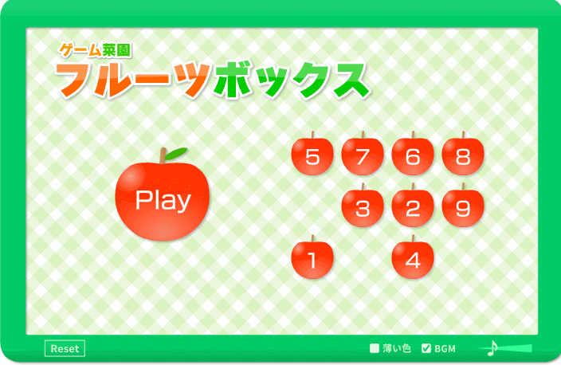

# Fruit Box Game Automation

An automation macro for Apple Game ([fruit_box_a](https://www.gamesaien.com/game/fruit_box_a/)) that intelligently detects and selects boxes for maximum points.



## Features

- Automatic recognition of the game grid
- Smart strategy calculation for optimal box selection
- Easy-to-use browser injection with a clean UI
- Real-time status updates during execution

## Installation

Clone this repository and install dependencies:

```shell
git clone https://github.com/somersby10ml/sum10.git
cd sum10
pip install -r requirements.txt
```

## Usage

### Start the Server

The server handles image recognition and strategy calculation:

```shell
python3 ./src/main.py
```

### Browser Setup

1. Go to [fruit_box_a](https://www.gamesaien.com/game/fruit_box_a/) in your browser
2. Open Developer Tools (F12 or Right-click → Inspect)
3. Navigate to the Console tab
4. Copy the entire content of the `injection.js` file and paste it into the console
5. Click the "Run Bot" button that appears in the top right corner of the game

## How It Works

1. The script captures the game canvas as an image
2. The server processes the image to recognize the grid pattern
3. An algorithm calculates the optimal box selection strategy
4. The script automatically performs drag actions to select boxes

## Requirements

- Python 3.6+
- Modern web browser (Chrome, Firefox, Edge)
- Local network access (for communication between browser and server)

## License

MIT